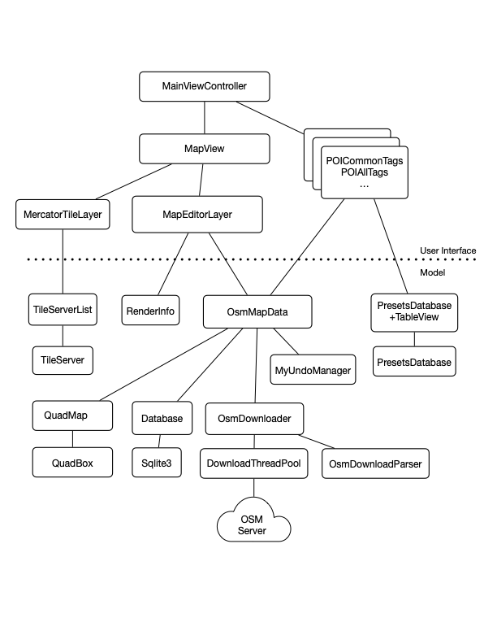

# Go Map!!

Go Map!! is an iPhone/iPad editor for adding cartographic information to [OpenStreetMap][1].

[![Download on the App Store badge][2]][3]

## Join our TestFlight beta!

Do you want to help testing pre-releases of Go Map!!?
[Become a TestFlight tester][4] today! 🚀

## Source code structure

* iOS - Code specific to the iOS app
* Mac - Code specific to the Mac app (old, doesn't build anymore)
* Shared - Shared code (drawing code, OSM data structures, etc)
* Images - Images used for application elements (buttons, etc)
* POI-Icons - Icons used for map elements (POIs, etc)
* presets - The presets database copied from the iD editor
* xliff - Translation files

## External assets

A number of assets used in the app come from other repositories, and should be periodically updated. Because updating these items can be a lengthy process it is performed manually rather than at build time:
- iD presets database (https://github.com/openstreetmap/id-tagging-schema) 
- iD presets icons (https://github.com/ideditor/temaki, https://github.com/mapbox/maki)
- Name Suggestion Index (https://github.com/osmlab/name-suggestion-index)
- NSI brand imagery (pulled from Facebook/Twitter/Wikipedia)
- StreetComplete quest filters (https://github.com/streetcomplete/StreetComplete)
- WebLate translations (https://hosted.weblate.org/projects/go-map/app)

### How to update external assets

Starting from the `src` directory:
- `(cd presets && ./update.sh)`				# fetches latest presets.json, etc. files and NSI
- `(cd presets && ./getBrandIcons.py)`		# downloads images from various websites and converts them to png as necessary
- `(cd presets && ./uploadBrandIcons.sh)`	# uploads imagery to gomaposm.com where they can be downloaded on demand at runtime (password required)
- `(cd POI-Icons && ./update.sh)`			# fetches maki/temaki icons 
- `(cd xliff && ./update.sh)`					# downloads latest translations from weblate (password required). This step is very noisy and produces many pages of warnings that can be ignored.

## Continuous integration

### Prerequisite

- Make sure you have _fastlane_ installed. (From a terminal, change to the `src/iOS` directory and run `bundle install`.)
- Since _fastlane_ stores your provisioning profiles and certificates in a Git repository (`MATCH_REPO`), you need to create a new, empty repository if you haven't already. The profiles and certificates are protected by a password (`MATCH_PASSWORD`).
- When creating the Beta locally, _fastlane_ will make sure that your certificates and provisioning profiles are up-to-date.

### How to release a Beta locally

You'll need to obtain the values for the following parameter:

- `MATCH_REPO`: The URL to the Git repository that contains the provisioning profiles/certificates
- `MATCH_PASSWORD`: The password for encrypting/decrypting the provisioning profiles/certificates
- `FASTLANE_TEAM_ID`: The ID of the developer team at developer.apple.com
- `FASTLANE_USER`: The email address that is used to sign in to App Store Connect
- `FASTLANE_ITC_TEAM_ID`: The ID of the team at appstoreconnect.apple.com

In order to release a new Beta to the TestFlight testers, run

    % MATCH_REPO=<GIT_REPOSITORY_URL> \
      MATCH_PASSWORD=<MATCH_PASSWORD> \
      FASTLANE_TEAM_ID=<APPLE_DEVELOPER_TEAM_ID> \
      FASTLANE_USER=<APP_STORE_CONNECT_EMAIL> \
      FASTLANE_ITC_TEAM_ID=<APP_STORE_CONNECT_TEAM_ID> \
      bundle exec fastlane beta

## Formatting

In order to have a consistent code style, please make sure to install
[SwiftFormat][6] and run it on a regular basis. Consider setting up a `pre-commit`
Git hook, as described [here][7].

## Assets

The Go Map!! app icon was created by [@Binnette][5].

[1]: https://www.openstreetmap.org
[2]: download-on-the-app-store.png
[3]: https://itunes.apple.com/app/id592990211
[4]: https://testflight.apple.com/join/T96F9wYq
[5]: https://github.com/Binnette
[6]: https://github.com/nicklockwood/SwiftFormat
[7]: https://github.com/nicklockwood/SwiftFormat#git-pre-commit-hook

## Presets and translation

Go Map!! is using iD presets, so you can improve translations [by improving translations of iD presets](https://github.com/openstreetmap/id-tagging-schema).

